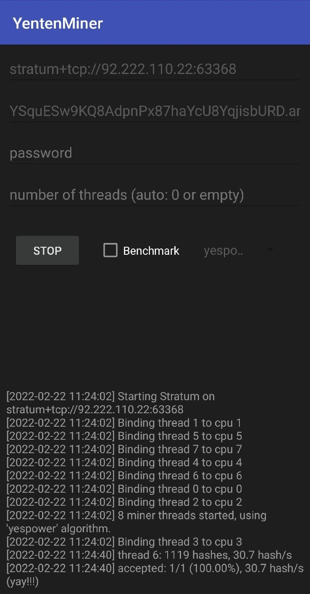
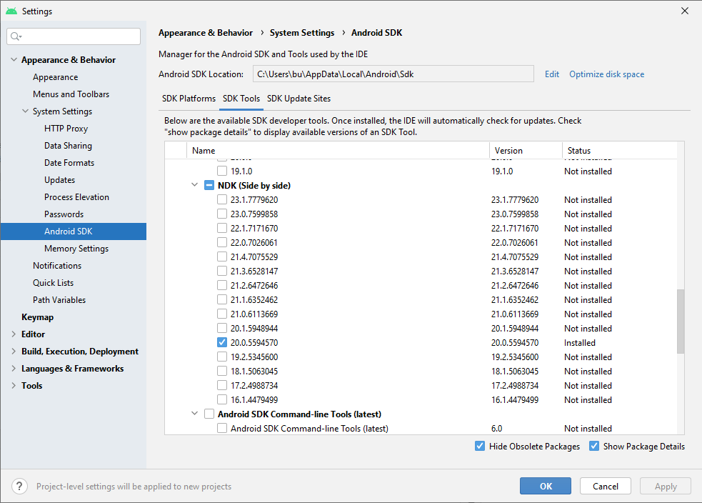
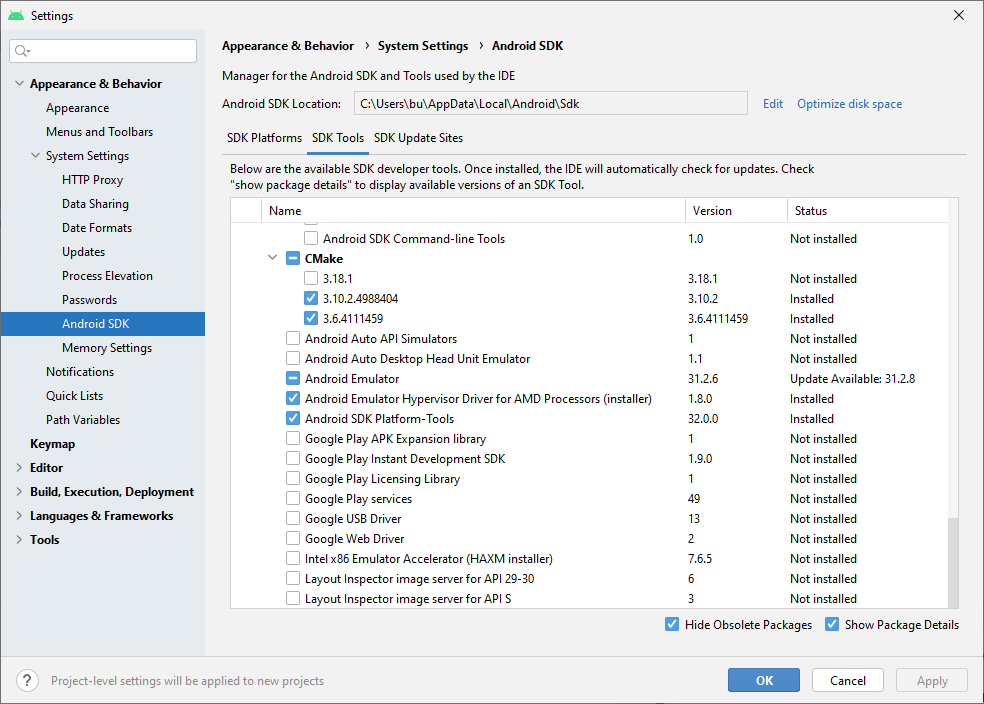

# yenten-android-miner

Android Yenten Miner for yespowerr16 algo. Android studio cpuminer


## Environment

tested on Android Studio Bumblebee 2021.1.1

NDK - 20.0.5594570

Android Gradle Plugin Version = 3.6.1

Gradle Version = 5.6.4









### Constructors


```
public BitZenyMiningLibrary()
```
```
public BitZenyMiningLibrary(Handler handler)
```

Library `putString` log strings with 'log' tag. Applications can `getString` then use the log strings.


### Methods

```
public boolean isMiningRunning()
public int startMining(String url, String user, String password, int n_threads)
public int startBenchmark(int n_threads)
public int stopMining()
```

### copyright
OttyLab - 2018
Yentencoin - 2022
